# frontend
masuk ke direktori frontend

pindah ke branch production
```shell
git branch production
```
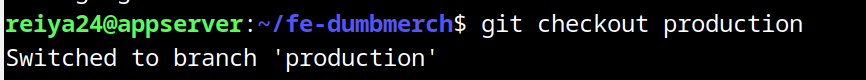

buat file .dockerignore
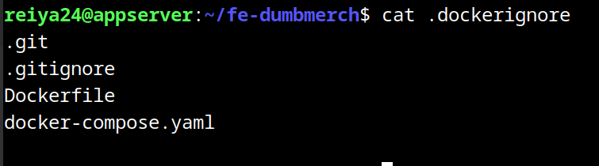

buat file .env
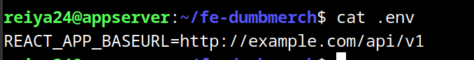

buat Dockerfile
```shell
FROM node:16-alpine as build
WORKDIR /home/app
COPY . .
RUN npm install --production
ARG REACT_APP_BASEURL="https://api.reiya.my.id/api/v1"
RUN npm run build

FROM node:16-alpine
WORKDIR /home/app
COPY --from=build /home/app /home/app
RUN npm install -g serve
EXPOSE 3000
CMD ["serve","-s","build"]
```
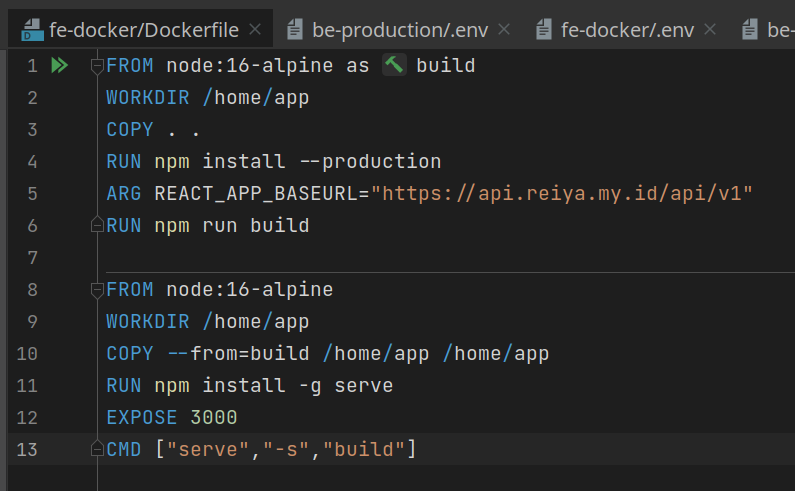

build Dockerfile
```shell
docker build -t reiya24/dumbmerch-frontend-production . --progress=plain --no-cache
```
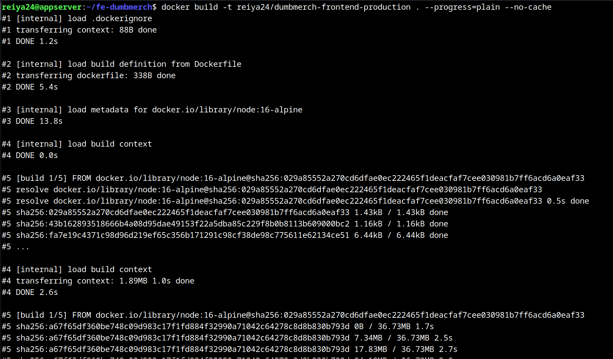

buat docker compose
```shell
version: '3.7'
services:
  frontend-production:
    container_name: frontend-production
    image: reiya24/dumbmerch-frontend-production
    stdin_open: true
    restart: unless-stopped
    ports:
      - 3000:3000
```
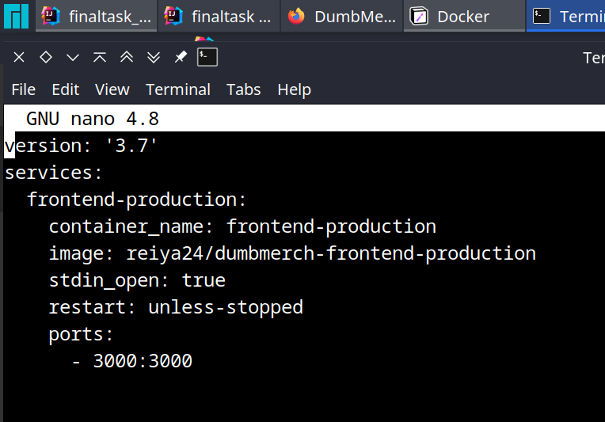

jalankan docker compose
```shell
docker compose up -d
```
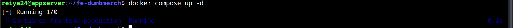

simpan perubahan ke git
```shell
git add . && git commit -m "setup docker"
```
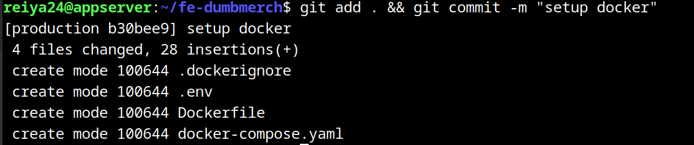

# database

inisialisasi direktori database dengan git
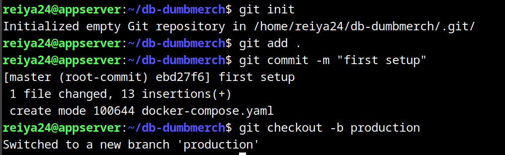

buat docker compose
```shell
version: '3.7'
services:
  database-production:
    image: postgres:alpine
    container_name: database-production
    restart: unless-stopped
    environment:
      - POSTGRES_USER=reiya
      - POSTGRES_PASSWORD=reiya
      - POSTGRES_DB=reiya
    ports:
      - '5432:5432'
    volumes:
      - ~/konfigurasi_posgres_production:/var/lib/postgresql/data
```
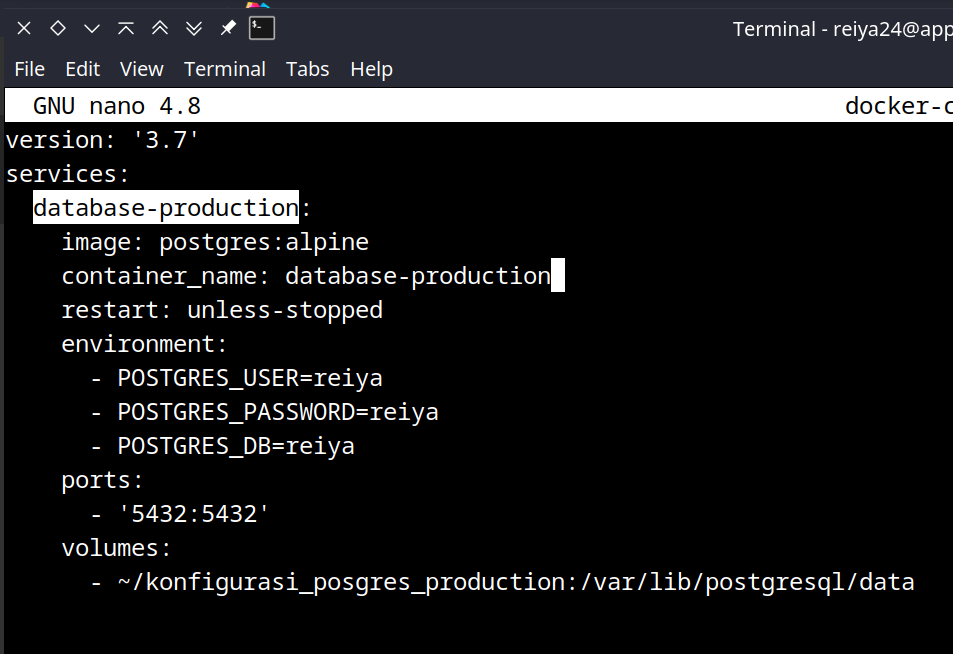

jalankan docker compose
```shell
docker compose up -d
```
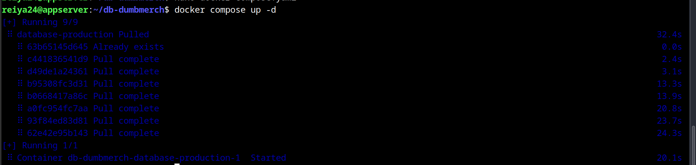

simpan perubahan di git
```shell
git add . && git commit -m "setup compose production"
```
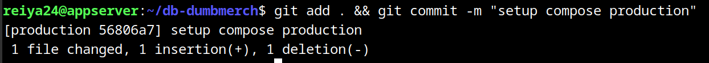

# backend

pastikan di branch production

buat .dockerignore
```shell
.git
.gitignore
Dockerfile
docker-compose.yaml
```
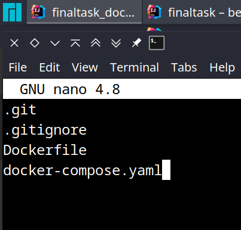

buat Dockerfile
```shell
FROM golang:1.18-alpine as builder
WORKDIR /home/app
COPY . .
RUN go mod download
ARG DB_HOST=10.116.106.150
ARG DB_USER=reiya
ARG DB_PASSWORD=reiya
ARG DB_NAME=reiya
ARG DB_PORT=5432
ARG PORT=5000
RUN CGO_ENABLED=0 go build

FROM gcr.io/distroless/cc-debian11
WORKDIR /home/app
COPY --from=builder /home/app/dumbmerch /home/app
COPY --from=builder /home/app/.env /home/app
EXPOSE 5000
CMD ["/home/app/dumbmerch"]
```
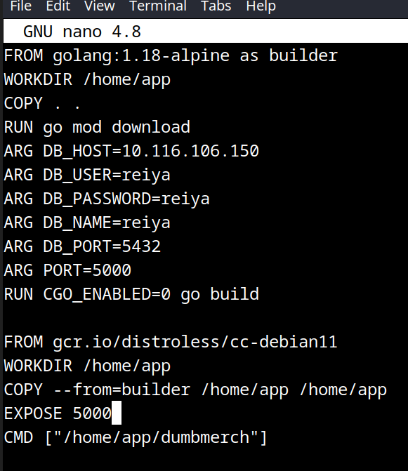

build Dockerfile
```shell
docker build -t reiya24/dumbmerch-backend-production . --progress=plain --no-cache
```
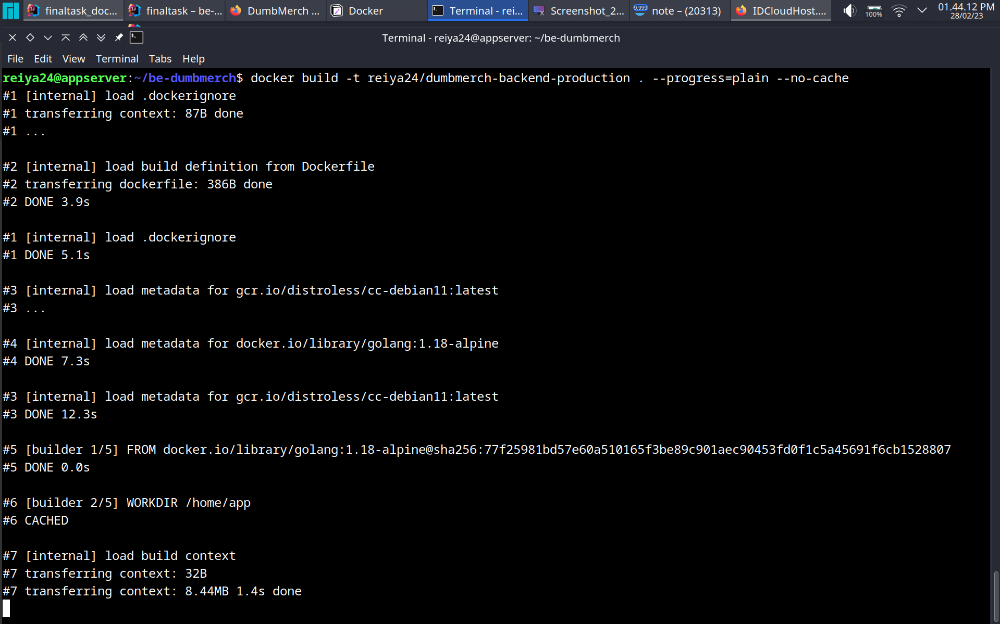

buat file docker compose
```shell
version: '3.7'
services:
 backend-production:
  image: reiya24/dumbmerch-backend-production
  container_name: backend-production
  stdin_open: true
  restart: unless-stopped
  ports:
   - 5000:5000
```
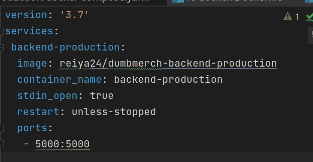

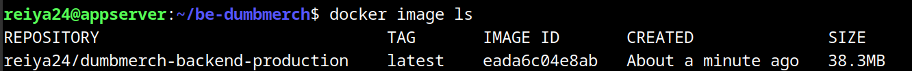

jalankan docker compose
```shell
docker compose up -d
```
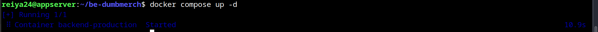

simpan perubahan di git
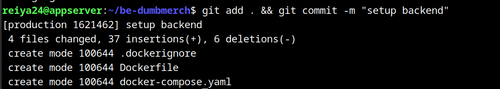

integrasi backend dengan database berhasil berjalan
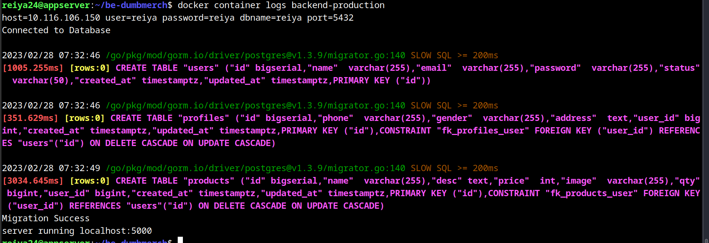

