# frontend

pindah ke branch staging

buat file .dockerignore
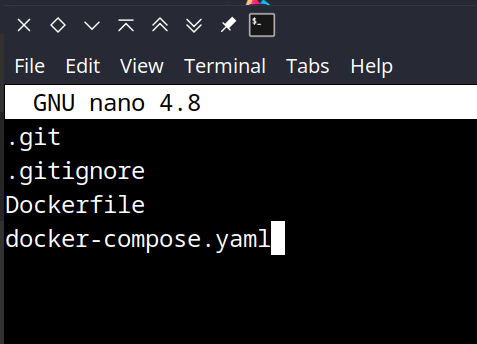

buat Dockerfile
```shell
FROM node:12.16-alpine3.11 as build
WORKDIR /home/app
COPY . .
RUN npm install

FROM node:12.16-alpine3.11
WORKDIR /home/app
COPY --from=build /home/app /home/app
EXPOSE 3000
CMD ["npm","start"]
```
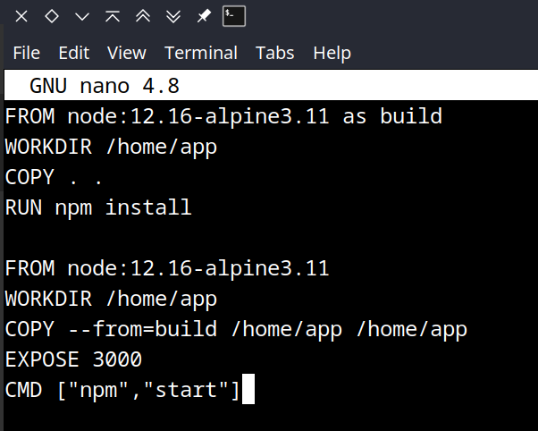

build Dockerfile
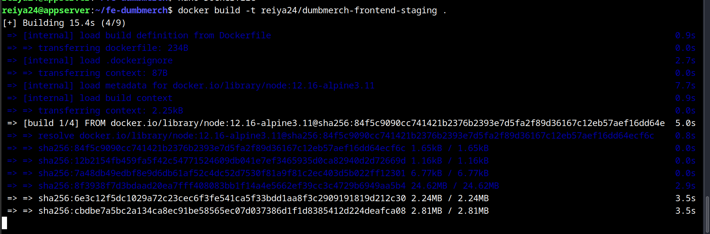

buat file docker compose
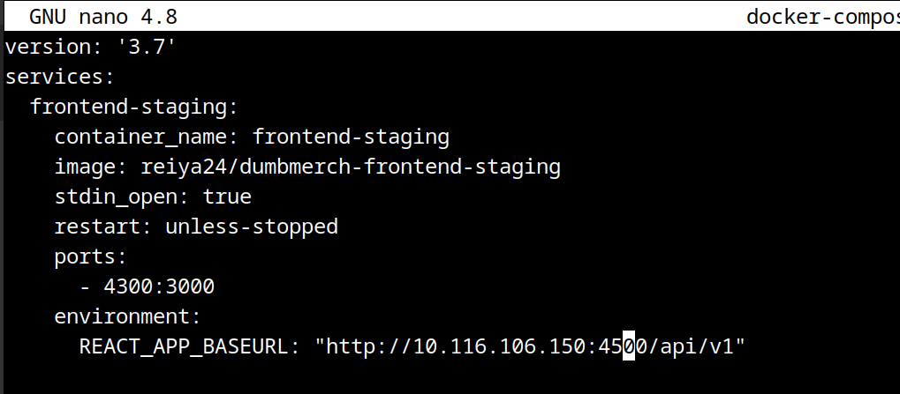

jalankan docker compose
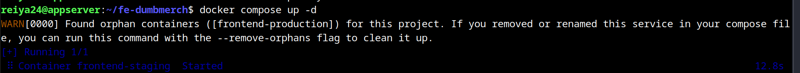

simpan perubahan di git
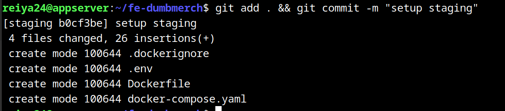

# database
pindah ke branch staging

buat docker compose
```shell
version: '3.7'
services:
  database-staging:
    image: postgres:alpine
    container_name: database-staging
    restart: unless-stopped
    environment:
      - POSTGRES_USER=reiya
      - POSTGRES_PASSWORD=reiya
      - POSTGRES_DB=reiya
    ports:
      - '4400:5432'
    volumes:
      - ~/konfigurasi_posgres_staging:/var/lib/postgresql/data
```
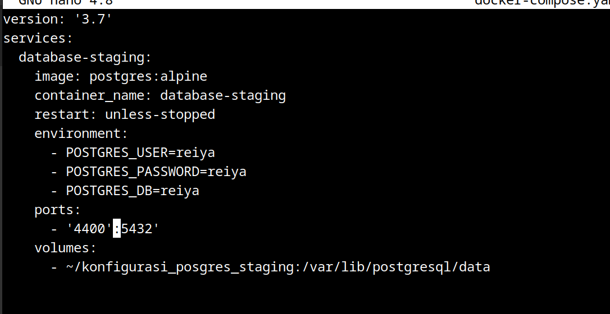

jalankan docker compose
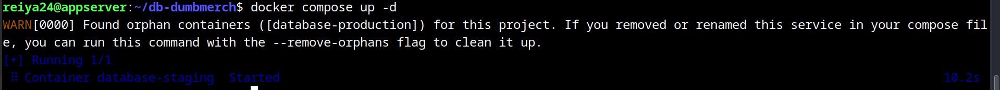

# backend

buat file .dockerignore
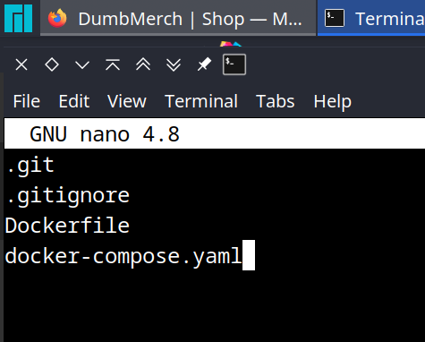

buat Dockerfile
buat Dockerfile
```shell
FROM golang:1.18-alpine as builder
WORKDIR /home/app
COPY . .
RUN CGO_ENABLED=0 go build

FROM gcr.io/distroless/cc-debian11
WORKDIR /home/app
COPY --from=builder /home/app/dumbmerch /home/app
COPY --from=builder /home/app/.env /home/app
EXPOSE 5000
CMD ["/home/app/dumbmerch"]
```
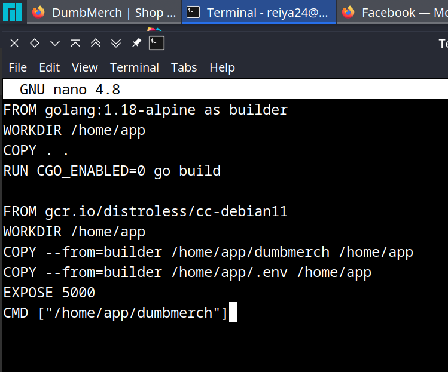

build Dockerfile
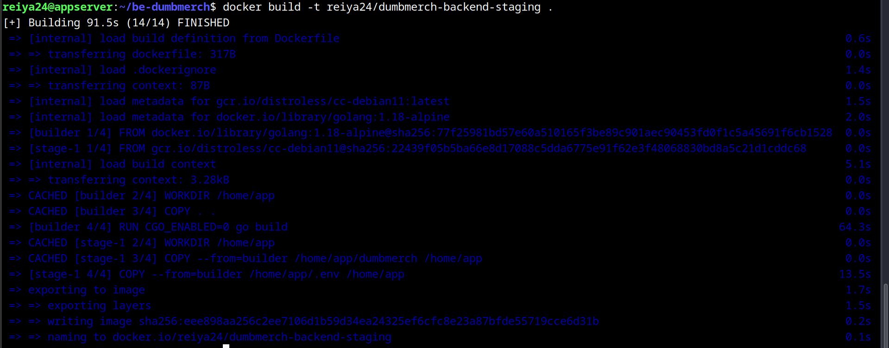

buat docker compose
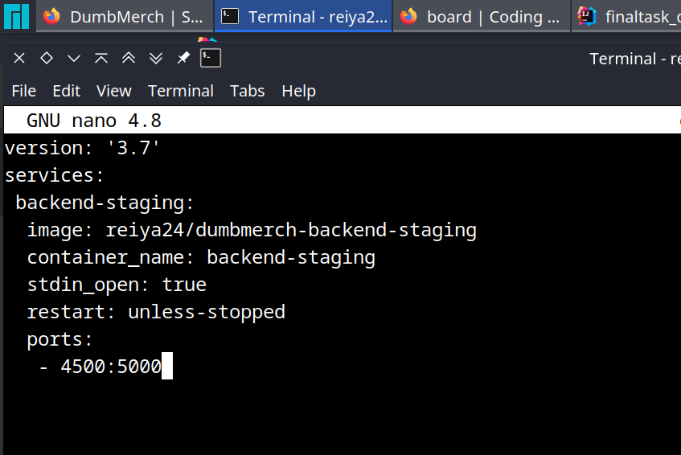

jalankan docker compose
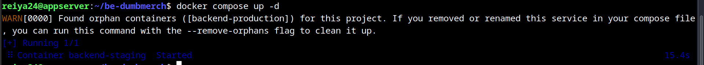

simpan perubahan di git
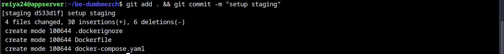

setup berhasil
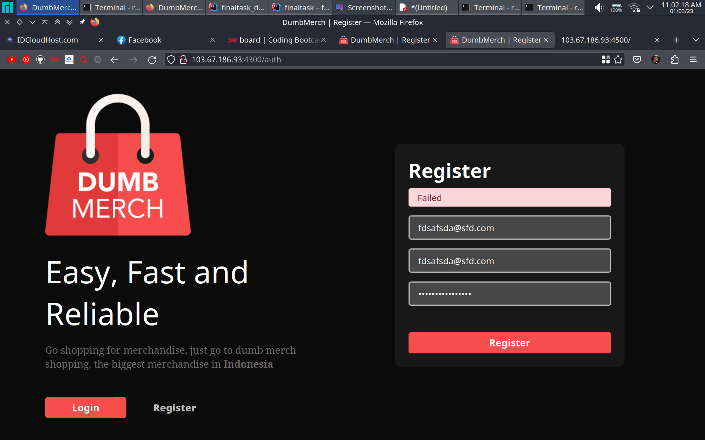
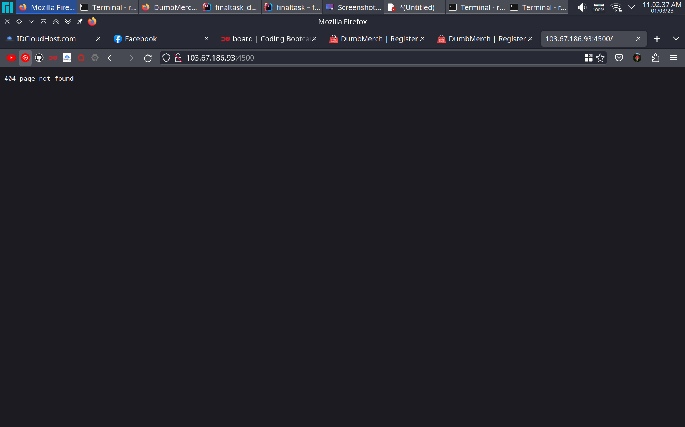