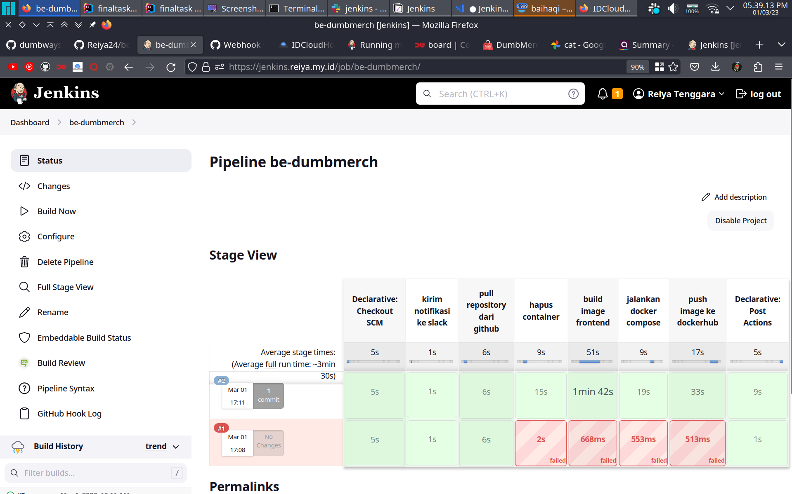

copy password di 
```shell
docker logs jenkins
```


paste ke website


select plugin to install


pilih plugin yang diperlukan


tunggu sampai proses instalasi selesai


masukan form


masukan domain


# setup credentials di jenkins

pada dashboard jenkins, pergi ke manage jenkins > manage credentials > global >
add credentials


masukan private key


# setup credentials di jenkins
pada website github, pergi ke setting > SSH and GPG keys > new SSH key, masukan
public key


SSH key berhasil ditambahkan


# setup agar bisa terkoneksi dengan github di koneksi pertama
pilih manage jenkins > configure global security 


scroll ke bagian paling bawah, accept first connection


# setup notifikasi dengan slack
install plugin slack notification, dashboard > manage jenkins, manage plugins 


pada available plugins, cari plugin slack notification, pilih download now and isntall after restart 


tunggu sampai proses instalasi berhasil


buka halaman https://my.slack.com/services/new/jenkins-ci, lalu pilih workspace 


pilih channel


setelah itu scroll kebawah, kita akan menemukan team subdomain, dan integration token credential ID 


copy integration token credential ID, lalu tambahkan di credential jenkins, pada menu kind, pilih secret text


setelah itu, pada dashboard jenkins > manage jenkins > configure system, cari menu slack, masukan form yang diperlukan, untuk workspace masukan team subdomain tadi, 
disarankan untuk test connection terlebih dahulu sebelum save 


# setup github repository
buat private github repository


pada folder frontend, tambahkan branch remote
```shell
git remote add origin git@github.com:Reiya24/fe-dumbmerch.git
```


push semua branch ke github
```shell
git push origin --all
```


push berhasil


# setup github webhook
pada project github, pilih settings, webhook, add webhook


masukan URL jenkins


integrasi berhasil


# membuat pipeline

klik create job, pilih  pipeline job


ceklis github hook trigger for scm polling


definition, pilih git, masukan repository, ssh ke
y, dsb


matikan lightweight checkout

pada direktori frontend, buat Jenkinsfile
```shell
pipeline {
    agent any

    environment{
        def branch = "production"
        def nama_repository = "origin"
        def directory = "~/fe-dumbmerch"
        def credential = 'id_rsa'
        def server = 'reiya24@10.116.106.150'
        def docker_image = 'reiya24/dumbmerch-frontend-production'
        def nama_container = 'frontend-production'
    }

    options {
        disableConcurrentBuilds()
        timeout(time: 40, unit: 'MINUTES')
    }

    stages {

        stage('kirim notifikasi ke slack') {
            steps {
                slackSend(message: "mulai job baru : ${env.JOB_NAME} ${env.BUILD_NUMBER} (<${env.BUILD_URL}|Open>)")
            }
        }

        stage('pull repository dari github ') {
            steps {
                sshagent([credential]){
                    sh"""
                    ssh -o StrictHostKeyChecking=no ${server} << EOF
                    cd ${directory}
                    git pull ${nama_repository} ${branch}
                    exit
                    EOF"""
                }
            }
        }

        stage('hapus container') {
            steps {
                sshagent([credential]){
                    sh"""
                    ssh -o StrictHostKeyChecking=no ${server} << EOF
                    docker container stop ${nama_container}
                    docker container rm ${nama_container}
                    exit
                    EOF"""
                }
            }
        }

        stage('build image frontend') {
            steps {
                sshagent([credential]){
                    sh"""ssh -o StrictHostKeyChecking=no ${server} << EOF
                    cd ${directory}
                    docker build -t ${docker_image}:latest .
                    exit
                    EOF"""
                }
            }
        }

        stage('jalankan docker compose') {
            steps {
                sshagent([credential]){
                    sh"""ssh -o StrictHostKeyChecking=no ${server} << EOF
                    cd ${directory}
                    docker compose up -d
                    exit
                    EOF
                    """
                }
            }
        }
        
        stage('push image ke dockerhub') {
            steps {
                sshagent([credential]){
                    sh"""
                    ssh -o StrictHostKeyChecking=no ${server} << EOF
                    cd ${directory}
                    docker image push ${docker_image}:latest
                    exit
                    EOF"""
                }
            }
        }
    }

    post {

        aborted {
            slackSend(message: "build digagalkan secara manual : ${env.JOB_NAME} ${env.BUILD_NUMBER} (<${env.BUILD_URL}|Open>)")
        }
        failure {
            slackSend(message: "build failed : ${env.JOB_NAME} ${env.BUILD_NUMBER} (<${env.BUILD_URL}|Open>)")
        }

        success {
            slackSend(message: "build success : ${env.JOB_NAME} ${env.BUILD_NUMBER} (<${env.BUILD_URL}|Open>)")
        }
        
    }
}
```

push ke github repository


jenkins akan membuild secara otomtatis


notifikasi berhasil


## lakukan hal yang sama untuk backend


# multibranch
install plugin multibranch scan webhook trigger


pilih new item

masukan nama branch, pilih multibranch pipeline


setup branch source


ceklis scan by webhook


jenkins akan mengscan branch yang memiliki Jenkinsfile


```shell
pipeline {
    agent any

    environment{
        def branch = "production"
        def nama_repository = "origin"
        def directory = "~/fe-dumbmerch"
        def credential = 'id_rsa'
        def server = 'reiya24@10.116.106.150'
        def docker_image = 'reiya24/dumbmerch-frontend-production'
        def nama_container = 'frontend-production'
    }

    options {
        disableConcurrentBuilds()
        timeout(time: 40, unit: 'MINUTES')
    }

    stages {

        stage('kirim notifikasi ke slack') {
            steps {
                slackSend(message: "mulai job baru : ${env.JOB_NAME} ${env.BUILD_NUMBER} (<${env.BUILD_URL}|Open>)")
            }
        }

        stage('pull repository dari github ') {
            steps {
                sshagent([credential]){
                    sh"""
                    ssh -o StrictHostKeyChecking=no ${server} << EOF
                    cd ${directory}
                    git checkout ${branch}
                    git pull ${nama_repository} ${branch}
                    exit
                    EOF"""
                }
            }
        }

        stage('hapus container') {
            steps {
                sshagent([credential]){
                    sh"""
                    ssh -o StrictHostKeyChecking=no ${server} << EOF
                    docker container stop ${nama_container}
                    docker container rm ${nama_container}
                    exit
                    EOF"""
                }
            }
        }

        stage('build image frontend') {
            steps {
                sshagent([credential]){
                    sh"""ssh -o StrictHostKeyChecking=no ${server} << EOF
                    cd ${directory}
                    docker build -t ${docker_image}:latest .
                    exit
                    EOF"""
                }
            }
        }

        stage('jalankan docker compose') {
            steps {
                sshagent([credential]){
                    sh"""ssh -o StrictHostKeyChecking=no ${server} << EOF
                    cd ${directory}
                    docker compose up -d
                    exit
                    EOF
                    """
                }
            }
        }
        
        stage('push image ke dockerhub') {
            steps {
                sshagent([credential]){
                    sh"""
                    ssh -o StrictHostKeyChecking=no ${server} << EOF
                    cd ${directory}
                    docker image push ${docker_image}:latest
                    exit
                    EOF"""
                }
            }
        }
    }

    post {

        aborted {
            slackSend(message: "build digagalkan secara manual : ${env.JOB_NAME} ${env.BUILD_NUMBER} (<${env.BUILD_URL}|Open>)")
        }
        failure {
            slackSend(message: "build failed : ${env.JOB_NAME} ${env.BUILD_NUMBER} (<${env.BUILD_URL}|Open>)")
        }

        success {
            slackSend(message: "build success : ${env.JOB_NAME} ${env.BUILD_NUMBER} (<${env.BUILD_URL}|Open>)")
        }
        
    }
}
```


## setup github webhook
pada repository github > pilih setting > webhook, masukan
```shell
https://jenkins.reiya.my.id/multibranch-webhook-trigger/invoke?token=backend
```


push ke github


trigger berhasil


