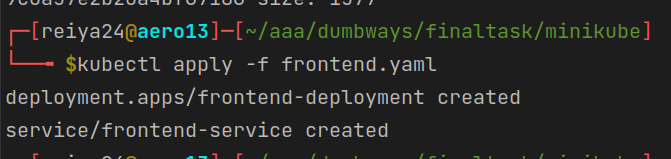
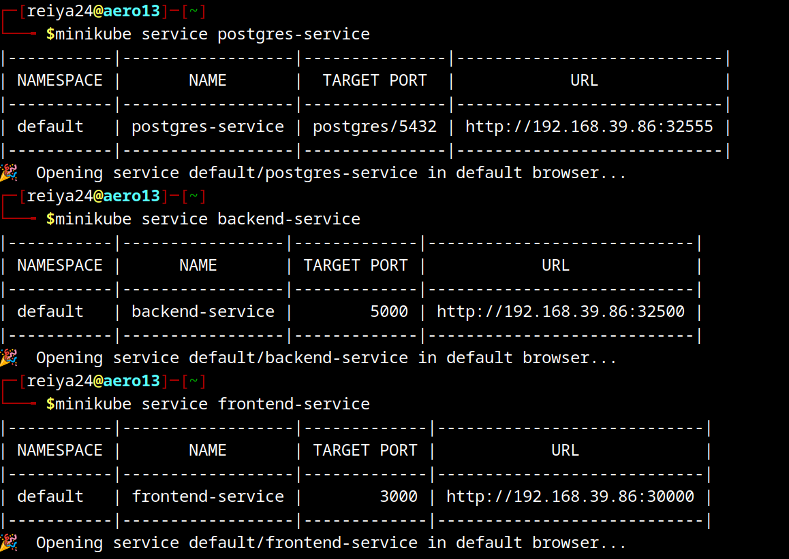
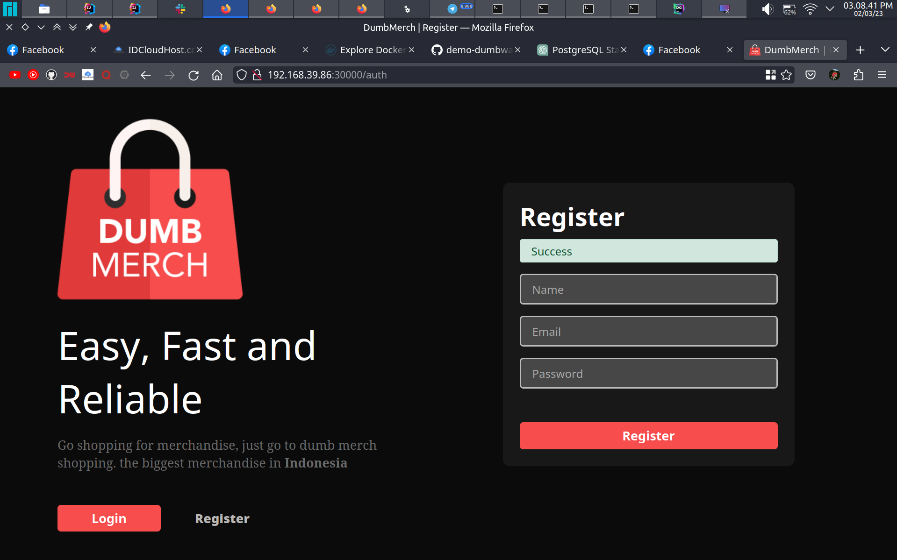
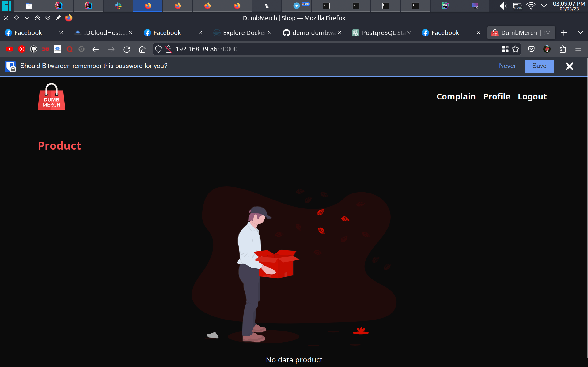

buat file konfigurasi kubernetes
# frontend
```yaml
apiVersion: apps/v1
kind: Deployment
metadata:
  name: frontend-deployment
spec:
  selector:
    matchLabels:
      app: frontend-label
  replicas: 1
  template:
    metadata:
      labels:
        app: frontend-label
    spec:
      containers:
        - name: frontend-container
          image: reiya24/dumbmerch-frontend:latest
          stdin: true
          stdinOnce: false
          tty: true
          ports:
            - containerPort: 3000

---

apiVersion: v1
kind: Service
metadata:
  name: frontend-service
spec:
  type: NodePort
  selector:
    app: frontend-label
  ports:
    - port: 3000
      targetPort: 3000
      nodePort: 30000
```

# backend

```yaml
apiVersion: apps/v1
kind: Deployment
metadata:
  name: backend-deployment
spec:
  selector:
    matchLabels:
      app: backend-label
  replicas: 1
  template:
    metadata:
      labels:
        app: backend-label
    spec:
      containers:
        - name: backend-container
          image: reiya24/dumbmerch-backend:latest
          stdin: true
          stdinOnce: false
          tty: true
          ports:
            - containerPort: 5000

---

apiVersion: v1
kind: Service
metadata:
  name: backend-service
spec:
  type: NodePort
  selector:
    app: backend-label
  ports:
    - port: 5000
      targetPort: 5000
      nodePort: 32500
```

database
```yaml
apiVersion: v1
kind: PersistentVolume
metadata:
  name: postgres-stateful-volume
spec:
  accessModes:
    - ReadWriteOnce
  capacity:
    storage: 10Gi
  hostPath:
    path: /var/lib/postgresql/data

---

apiVersion: apps/v1
kind: StatefulSet
metadata:
  name: postgres-stateful
  labels:
    name: postgres-stateful
spec:
  serviceName: postgres-stateful-service
  replicas: 1
  selector:
    matchLabels:
      name: postgres-stateful
  volumeClaimTemplates:
    - metadata:
        name: postgres-stateful-volume-claim
      spec:
        accessModes:
          - ReadWriteOnce
        volumeMode: Filesystem
        resources:
          requests:
            storage: 5Gi
  template:
    metadata:
      name: postgres-stateful
      labels:
        name: postgres-stateful
    spec:
      containers:
        - name: postgres-stateful
          image: postgres:latest
          env:
            - name: POSTGRES_USER
              value: reiya
            - name: POSTGRES_PASSWORD
              value: reiya
            - name: POSTGRES_DB
              value: reiya
          volumeMounts:
            - mountPath: /var/lib/postgresql/data
              name: postgres-stateful-volume-claim

---
apiVersion: v1
kind: Service
metadata:
  name: postgres-service
spec:
  selector:
    name: postgres-stateful
  type: NodePort
  ports:
    - name: postgres
      port: 5432
      targetPort: 5432
      nodePort: 32555

```

jalankan file konfigurasi
```yaml
kubectl apply -f nama_file.yaml
```



ekspose minikube


integrasi berhasil


