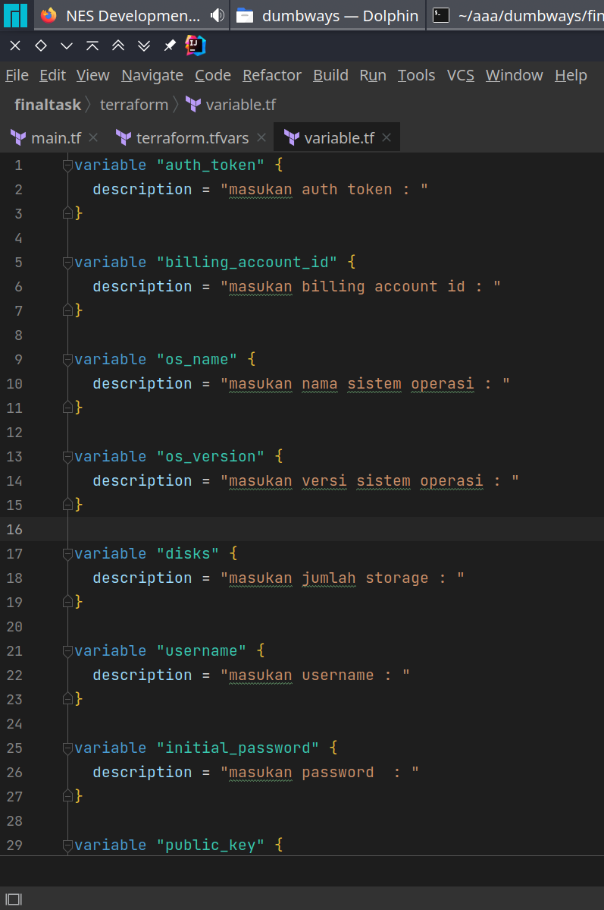
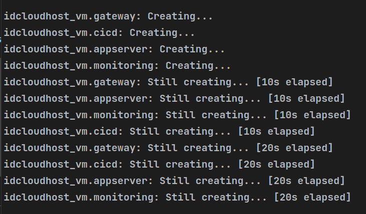

inisialisasi project terraform menggunakan perintah
```shell
terraform init
```


buat file main.tf
```terraform
terraform {
  required_providers {
    idcloudhost = {
      source  = "bapung/idcloudhost"
      version = "0.1.3"
    }
  }
}

provider "idcloudhost" {
  auth_token = var.auth_token
  region = "sgp01"
}

resource "idcloudhost_vm" "appserver" {
  billing_account_id = var.billing_account_id
  name               = "appserver"
  os_name            = var.os_name
  os_version         = var.os_version
  disks              = var.disks
  vcpu               = 2
  memory             = 2048
  username           = var.username
  initial_password   = var.initial_password
  public_key         = var.public_key
}

resource "idcloudhost_floating_ip" "appserver_network" {
  name               = "My Network"
  billing_account_id = var.billing_account_id
  assigned_to        = idcloudhost_vm.appserver.id
}

resource "idcloudhost_vm" "gateway" {
  billing_account_id = var.billing_account_id
  name               = "gateway"
  os_name            = var.os_name
  os_version         = var.os_version
  disks              = 20
  vcpu               = 1
  memory             = 1024
  username           = var.username
  initial_password   = var.initial_password
  public_key         = var.public_key

}

resource "idcloudhost_floating_ip" "gateway_network" {
  name               = "My Network"
  billing_account_id = var.billing_account_id
  assigned_to        = idcloudhost_vm.gateway.id
}

resource "idcloudhost_vm" "monitoring" {
  billing_account_id = var.billing_account_id
  name               = "monitoring"
  os_name            = var.os_name
  os_version         = var.os_version
  disks              = 20
  vcpu               = 2
  memory             = 2048
  username           = var.username
  initial_password   = var.initial_password
  public_key         = var.public_key

}

resource "idcloudhost_floating_ip" "monitoring_network" {
  name               = "My Network"
  billing_account_id = var.billing_account_id
  assigned_to        = idcloudhost_vm.monitoring.id
}

resource "idcloudhost_vm" "ci_cd" {
  billing_account_id = var.billing_account_id
  name               = "ci_cd"
  os_name            = var.os_name
  os_version         = var.os_version
  disks              = 20
  vcpu               = 2
  memory             = 2048
  username           = var.username
  initial_password   = var.initial_password
  public_key         = var.public_key

}

resource "idcloudhost_floating_ip" "ci_cd_network" {
  name               = "My Network"
  billing_account_id = var.billing_account_id
  assigned_to        = idcloudhost_vm.ci_cd.id
}
```

file variable.tf
```terraform
variable "auth_token" {
  description = "masukan auth token : "
}

variable "billing_account_id" {
  description = "masukan billing account id : "
}

variable "os_name" {
  description = "masukan nama sistem operasi : "
}

variable "os_version" {
  description = "masukan versi sistem operasi : "
}

variable "disks" {
  description = "masukan jumlah storage : "
}

variable "username" {
  description = "masukan username : "
}

variable "initial_password" {
  description = "masukan password  : "
}

variable "public_key" {
  description = "masukan public key : "
}
```



file terraform.tfvars
```terraform
username = "reiya24"
os_name = "ubuntu"
os_version = "20.04"
```


variable yang bernilai sensitif bisa dideklarasikan di terminal

```shell
export TV_VAR_public_key=
export TV_VAR_initial_password=
export TV_VAR_auth_token=
export TV_VAR_ billing_account_id=
```


jalankan perintah
```terraform
terraform apply
```


input yes untuk konfirmasi

tunggu sampai VPS berhasil dibuat


virtual machine berhasil dibuat
