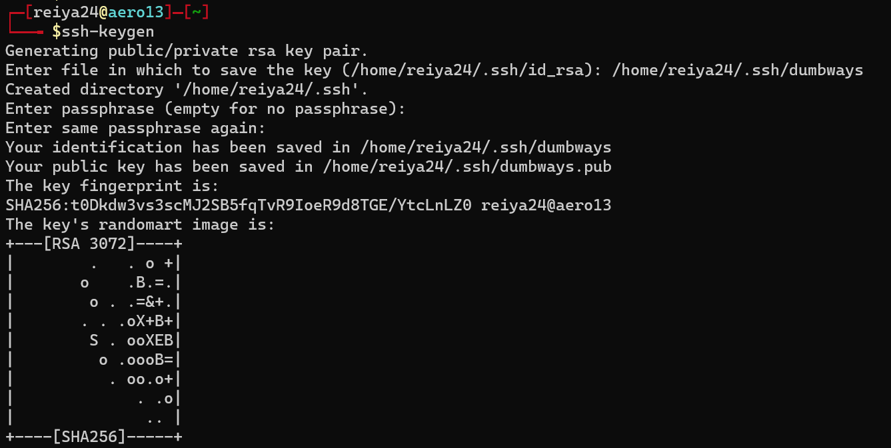

bila belum membuat ssh key, buat menggunakan perintah
```terraform
ssh-keygen
```


buat file .ssh/config
```shell
Host *
    User reiya24
    IdentityFile /home/reiya24/.ssh/id_rsa
    Port 22

Host appserver
  HostName 103.67.186.93

Host cicd
  HostName 103.67.186.92

Host gateway
  HostName 103.67.186.89

Host monitoring
  HostName 103.67.186.91

```

setup SSH config berhasil
