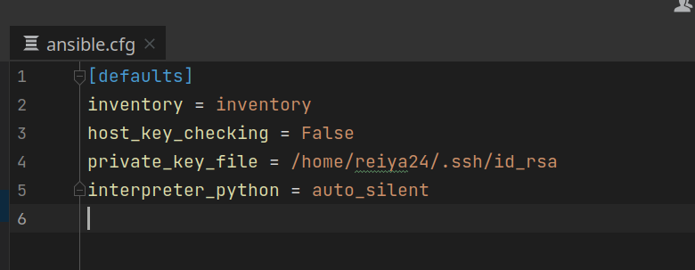
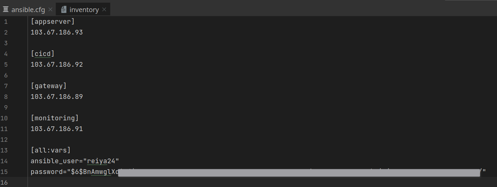

buat file ansible.cfg
```ini
[defaults]
inventory = inventory
host_key_checking = False
private_key_file = /home/reiya24/.ssh/id_rsa
interpreter_python = auto_silent
```


buat file inventory
```ini
[appserver]
103.67.186.93

[cicd]
103.67.186.92

[gateway]
103.67.186.89

[monitoring]
103.67.186.91

[all:vars]
ansible_user="reiya24"
password="$"

```


