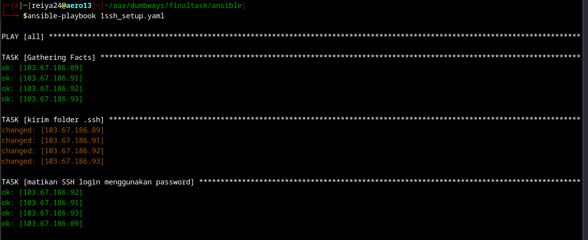
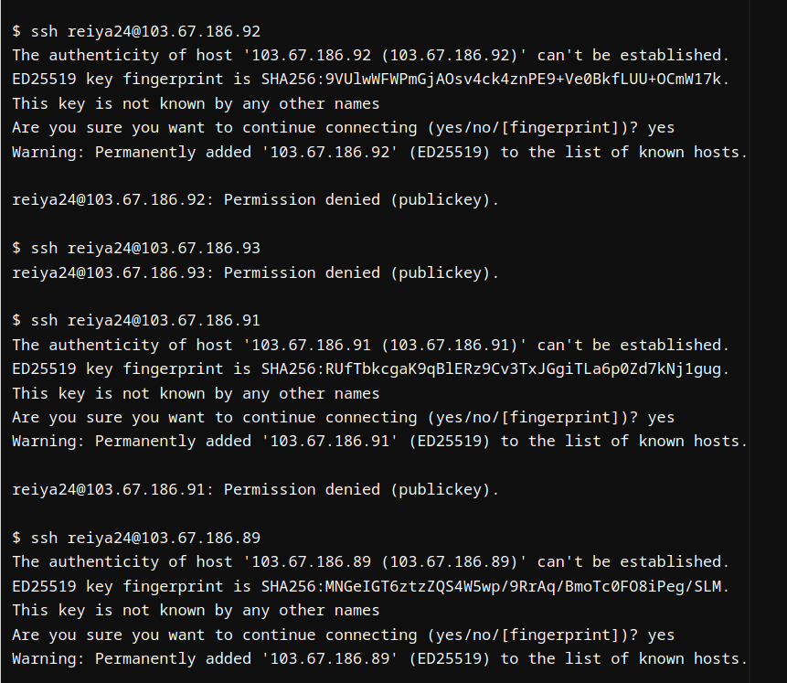

buat ansible playbook
```yaml
---
- hosts: all
  become: true
  become_user: "{{ansible_user}}"
  gather_facts: true
  tasks:
    - name: kirim folder .ssh
      copy:
        src: /home/{{ansible_user}}/.ssh/
        dest: /home/{{ansible_user}}/.ssh/
        owner: "{{ansible_user}}"
        mode: "0600"

    - name: "matikan SSH login menggunakan password"
      lineinfile:
        dest: /etc/ssh/sshd_config
        regexp: "^PasswordAuthentication"
        line: "PasswordAuthentication no"
        state: present

    - name: "restart service sshd"
      service:
        name: sshd
        state: restarted
```


catatan: untuk melakukan check syntax, gunakan perintah
```yaml
ansible-playbook nama_file.yaml --syntax-check
```

jalankan ansible playbook
```yaml
ansible-playbook nama_file.yaml
```



mematikakn password login ssh berhasil
