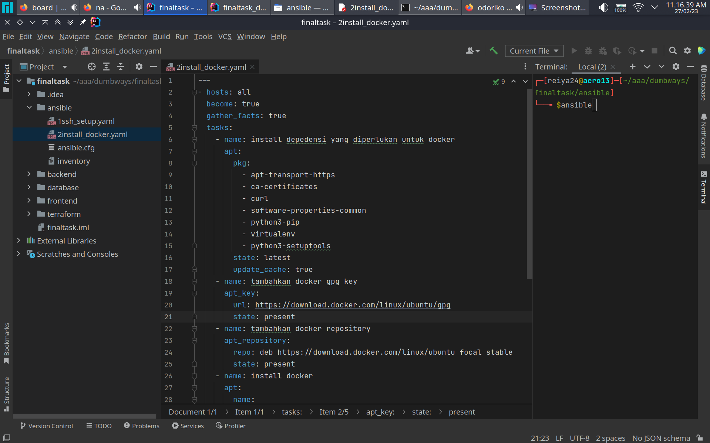
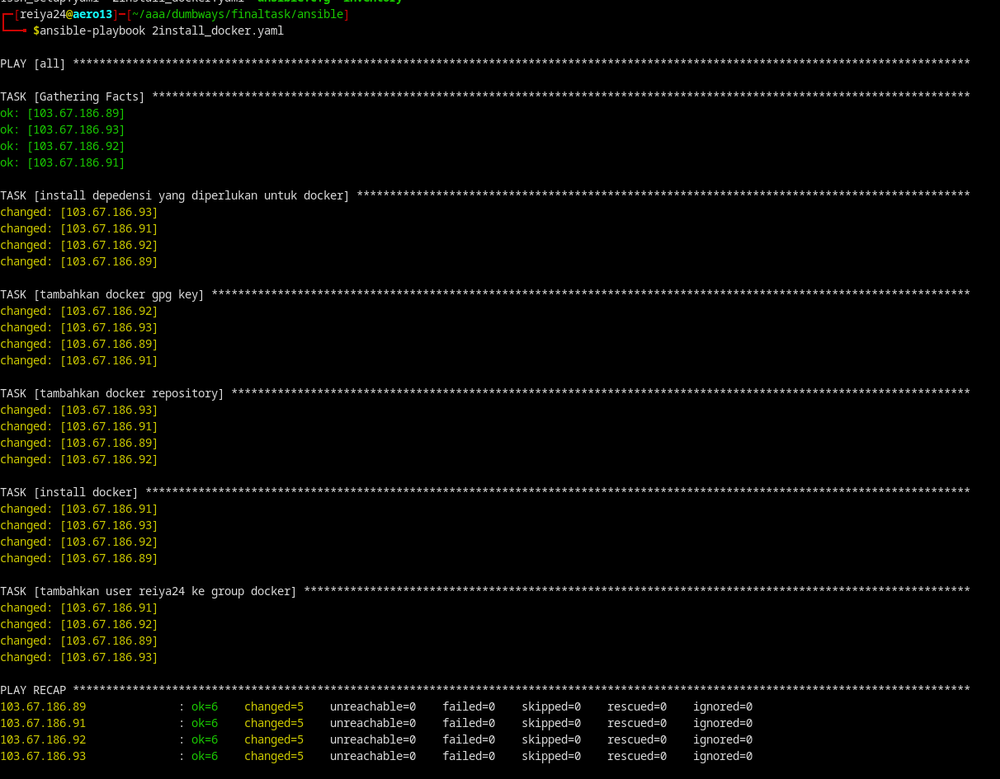

buat ansilbe playbook
```yaml
---
- hosts: all
  become: true
  gather_facts: true
  tasks:
    - name: install depedensi yang diperlukan untuk docker
      apt:
        pkg:
          - apt-transport-https
          - ca-certificates
          - curl
          - software-properties-common
          - python3-pip
          - virtualenv
          - python3-setuptools
        state: latest
        update_cache: true
    - name: tambahkan docker gpg key
      apt_key:
        url: https://download.docker.com/linux/ubuntu/gpg
        state: present
    - name: tambahkan docker repository
      apt_repository:
        repo: deb https://download.docker.com/linux/ubuntu focal stable
        state: present
    - name: install docker
      apt:
        name:
          - docker-ce
          - docker-ce-cli
          - containerd.io
          - docker-compose
          - docker-compose-plugin
        state: latest
        update_cache: yes
    - name: tambahkan user reiya24 ke group docker
      user:
        name: "{{ansible_user}}"
        groups: sudo, docker
        append: yes
```


jalankan ansible playbook
```yaml
ansible-playbook nama_file.yaml
```


