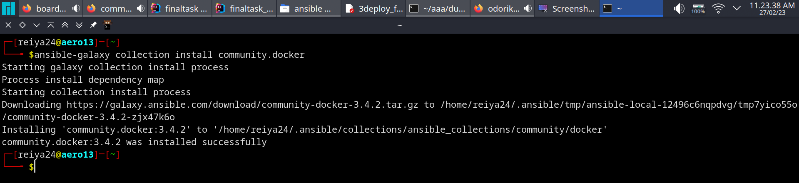
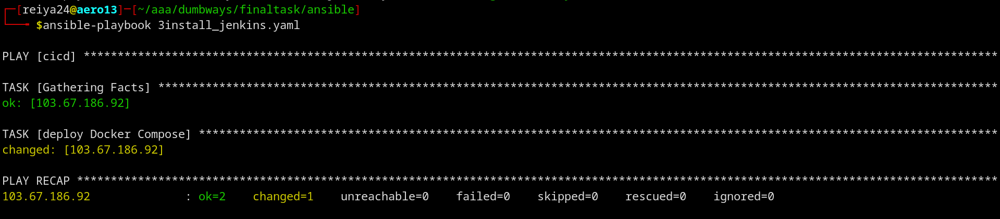
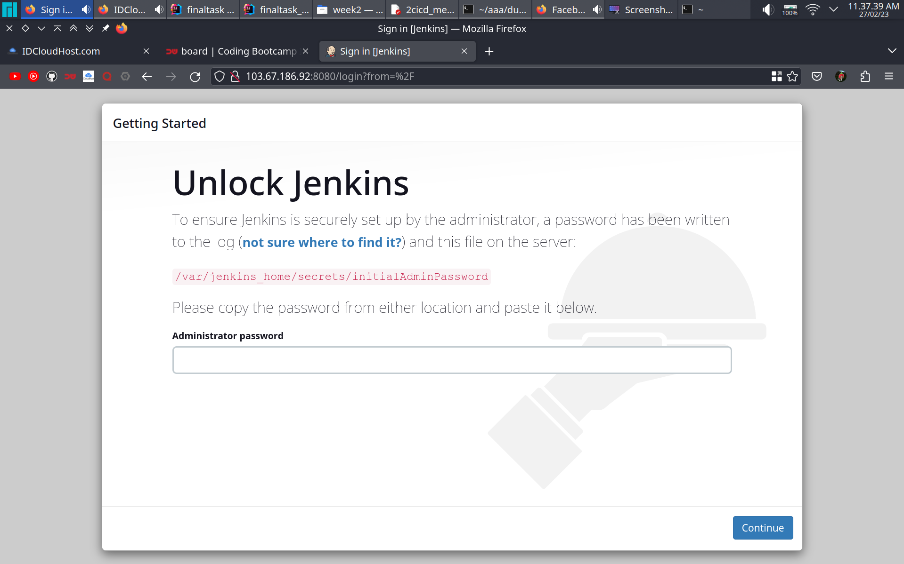

instal community module docker compose untuk ansible
```yaml
ansible-galaxy collection install community.docker
```


buat ansible playbook 
```yaml
---
- hosts: cicd
  become: true
  gather_facts: true
  tasks:
    - name: deploy Docker Compose
      community.docker.docker_compose:
        project_name: jenkins
        definition:
          version: '3.7'
          services:
            jenkins:
              container_name: jenkins
              image: jenkins/jenkins:latest-jdk11
              privileged: true
              user: root
              restart: unless-stopped
              ports:
                - 8123:8080
              volumes:
                - ~/jenkins_config:/var/jenkins_home
                - ~/jenkins-docker-certs:/certs/clien
```
jalankan ansible playbook
```shell
ansible-playbook nama_file.yaml
```


instalasi jenkins berhasil
