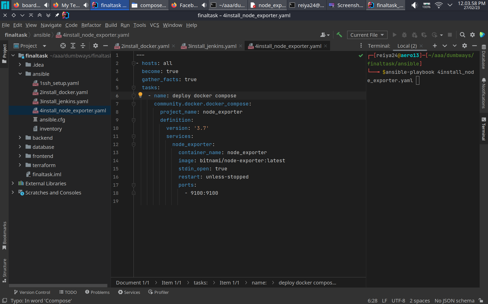
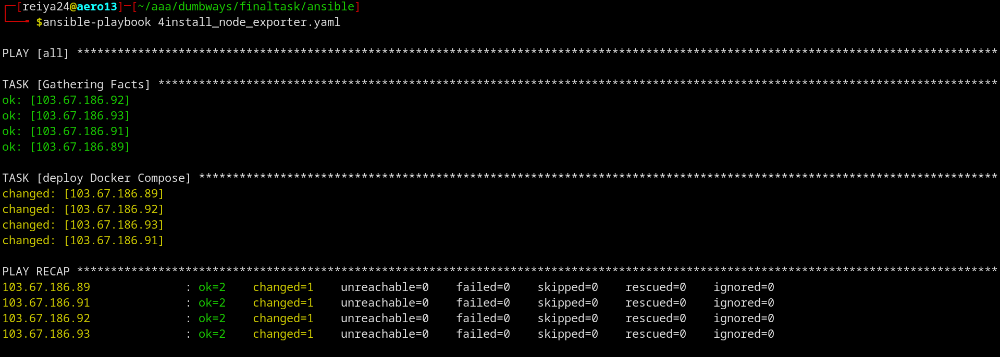

buat ansible playbook
```shell
---
- hosts: all
  become: true
  gather_facts: true
  tasks:
    - name: deploy Docker Compose
      community.docker.docker_compose:
        project_name: node_exporter
        definition:
          version: '3.7'
          services:
            node_exporter:
              container_name: node_exporter
              image: bitnami/node-exporter:latest
              stdin_open: true
              restart: unless-stopped
              ports:
                - 9100:9100
```


jalankan ansible playbook
```shell
ansible-playbook nama_file.yaml
```

