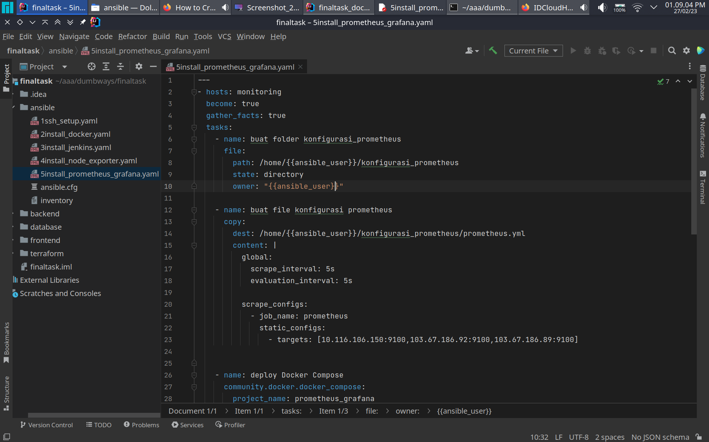

buat ansible playbook

```shell
---
- hosts: monitoring
  become: true
  gather_facts: true
  tasks:
    - name: buat folder konfigurasi_prometheus
      file:
        path: /home/{{ansible_user}}/konfigurasi_prometheus
        state: directory
        owner: "{{ansible_user}}"

    - name: buat file konfigurasi prometheus
      copy:
        dest: /home/{{ansible_user}}/konfigurasi_prometheus/prometheus.yml
        content: |
          global:
            scrape_interval: 5s
            evaluation_interval: 5s

          scrape_configs:
            - job_name: prometheus
              static_configs:
                - targets: [10.116.106.150:9100,103.67.186.92:9100,103.67.186.89:9100]


    - name: deploy Docker Compose
      community.docker.docker_compose:
        project_name: prometheus_grafana
        definition:
          version: '3.7'
          services:
            prometheus:
              container_name: prometheus
              image: bitnami/prometheus:latest
              stdin_open: true
              restart: unless-stopped
              ports:
                - 9090:9090
              volumes:
                - /home/{{ansible_user}}/konfigurasi_prometheus/prometheus.yml:/etc/prometheus/prometheus.yml
            grafana:
              container_name: grafana
              image: grafana/grafana:latest
              stdin_open: true
              restart: unless-stopped
              ports:
                - 3123:3000
              volumes:
                - grafana-storage:/etc/grafana/provisioning
                - grafana-storage:/var/lib/grafana
                - grafana-storage:/etc/grafana/config.ini
          volumes:
            grafana-storage:


```


jalankan ansible playbook
```shell
ansible-playbook nama_file.yaml
```
