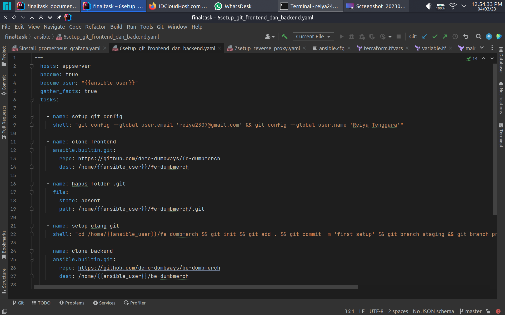
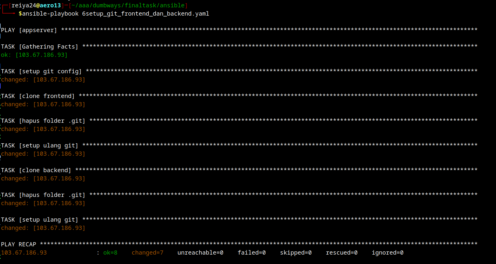

buat ansible playbook
```shell
---
- hosts: appserver
  become: true
  become_user: "{{ansible_user}}"
  gather_facts: true
  tasks:

    - name: setup git config
      shell: "git config --global user.email 'reiya2307@gmail.com' && git config --global user.name 'Reiya Tenggara'"

    - name: clone frontend
      ansible.builtin.git:
        repo: https://github.com/demo-dumbways/fe-dumbmerch
        dest: /home/{{ansible_user}}/fe-dumbmerch

    - name: hapus folder .git
      file:
        state: absent
        path: /home/{{ansible_user}}/fe-dumbmerch/.git

    - name: setup ulang git
      shell: "cd /home/{{ansible_user}}/fe-dumbmerch && git init && git add . && git commit -m 'first-setup' && git branch staging && git branch production && git branch cicd && git branch deployment"

    - name: clone backend
      ansible.builtin.git:
        repo: https://github.com/demo-dumbways/be-dumbmerch
        dest: /home/{{ansible_user}}/be-dumbmerch

    - name: hapus folder .git
      file:
        state: absent
        path: /home/{{ansible_user}}/be-dumbmerch/.git

    - name: setup ulang git
      shell: "cd /home/{{ansible_user}}/be-dumbmerch && git add . && git add . && git commit -m 'first-setup' && git branch staging && git branch production && git branch cicd && git branch deployment"

```


jalankan ansible playbook
```shell
ansible-playbook nama_file.yaml
```
